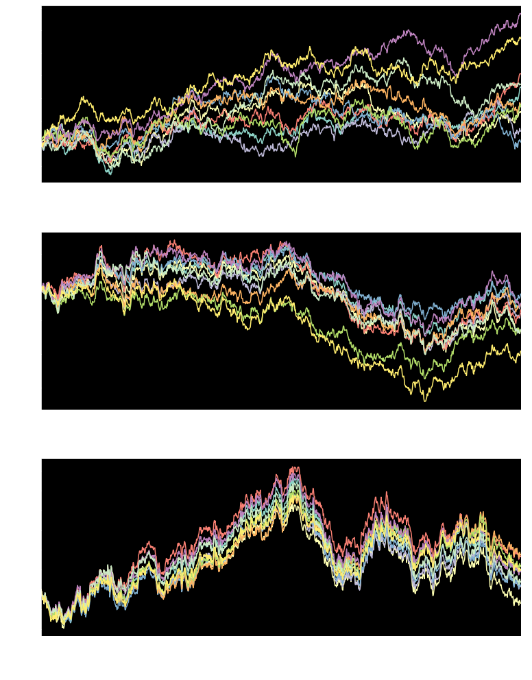
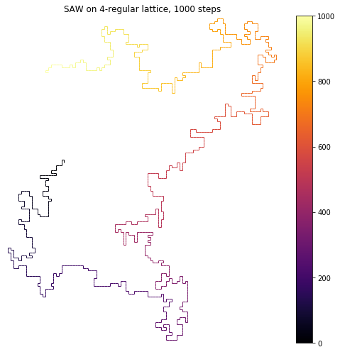
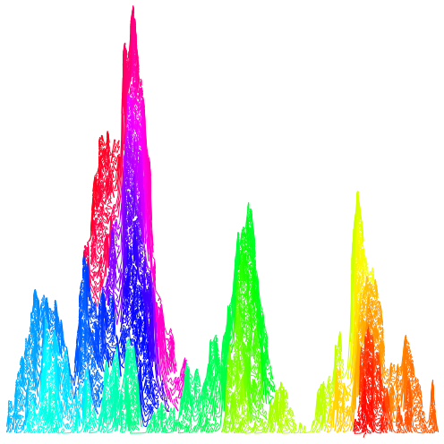

### ito_diffusions
Libraries for stochastic processes simulation and visualization including:
* Ito diffusion : Brownian motion, Geometric Brownian motion, Vasicek, CIR...
* Jump processes : Ito diffusion driven by a Levy process i.e with a jump component with a given intensity and jump size distribution
* Multidimensional processes, stochastic volatility diffusions (SABR...)
* Fractional Brownian motion, Karhunen-Loeve expansion, fractional diffusions
* Self-Avoiding Walks (SAW), Schramm-Loewner Evolution (SLE)

**To install** : pip install ito-diffusions
https://pypi.org/project/ito-diffusions/

For numerous examples : https://github.com/sauxpa/stochastic

