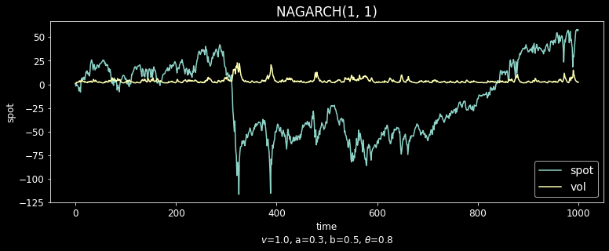

### ito_diffusions
Libraries for stochastic processes simulation and visualization including:
* Ito diffusion : Brownian motion, Geometric Brownian motion, Vasicek, CIR...
* Jump processes : Ito diffusion driven by a Levy process i.e with a jump component with a given intensity and jump size distribution;
* Multidimensional processes, stochastic volatility diffusions (SABR...);
* Fractional Brownian motion, Karhunen-Loeve expansion, fractional diffusions;
* Times series models (AR, MA, ARMA, ARCH, GARCH, NAGARCH...);
* Self-Avoiding Walks (SAW), Schramm-Loewner Evolution (SLE).

**To install** : pip install ito-diffusions
https://pypi.org/project/ito-diffusions/

**To test** : python -m pytest

For numerous examples : https://github.com/sauxpa/stochastic

